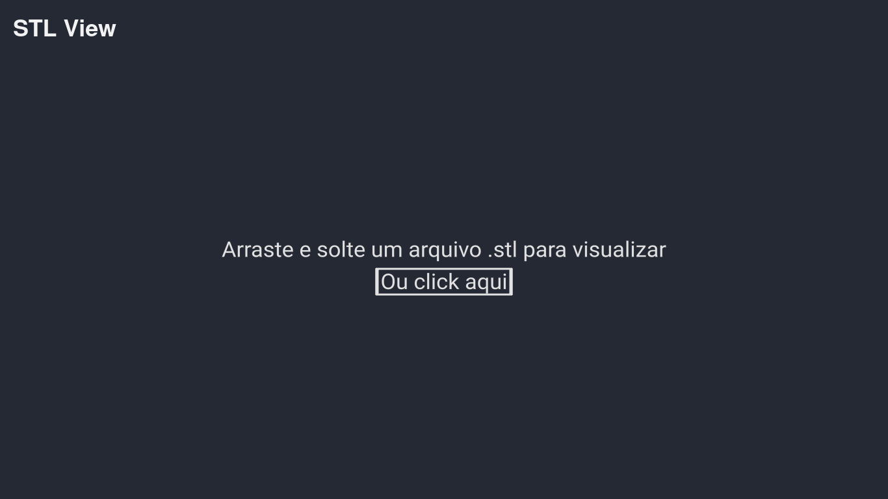
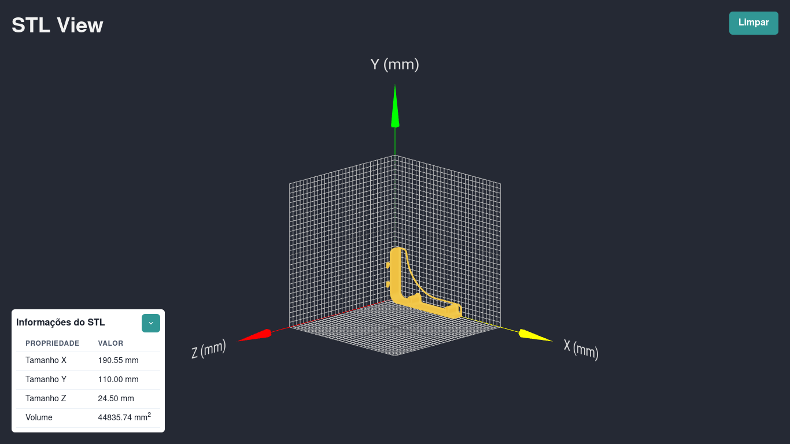

# STL View
Site para visualização 3D de arquivos stl pelo browser, acesse a aplicação [Demo](http://paulodavi.me/stl-view/) para testar.

## Home
Interface minimalista e com texto central em 3D, interface que permite fazer upload do arquivo stl pelo click ou arrastando e soutando, Caso o formato esteja correto o modelo é aberto, se não é mestrada uma mensagem de erro.

## Visualização
Ao abrir o modelo são mostradas as informações espaciais do modelo em milímetros e um grid com o objeto 3D, ode cada quadrado do grid representa 1 milímetro, possibilitando a movimentação 3D, zoom e pan do modelo.

## Tecnologias utilizadas
O projeto foi criado utilizando react-create-app e utiliza as seguintes tecnologias:

- react-three-forge
- three
- chakra-ui
- eslint
- prettier

## Como Utilizar
Primeiramente clone o repositório e execute o domando `yarn` ou `npm install` para instalar as dependências. Em seguida execute `yarn start` ou `npm run start` para executar a aplicação localmente, ela estará disponível em [http://localhost:3000](http://localhost:3000)
